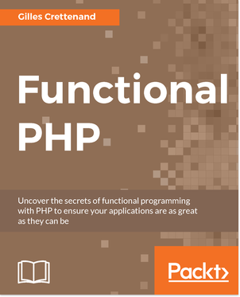

# PHP Functional
[](https://travis-ci.org/widmogrod/php-functional)
[](https://codeclimate.com/github/widmogrod/php-functional/test_coverage)
[](https://codeclimate.com/github/widmogrod/php-functional/maintainability)
## Introduction

Functional programing is a fascinating concept.
The purpose of this library is to explore `Functors`, `Applicative Functors` 
and `Monads` in OOP PHP, and provide examples of real world use case.

Monad types available in the project:
 * `State Monad`
 * `IO Monad`
 * `Free Monad`
 * `Either Monad`
 * `Maybe Monad`
 * `Reader Monad`
 * `Writer Monad`

Exploring functional programing space I noticed that working with primitive values from PHP 
is very hard and complicates implementation of many functional structures.
To simplify this experience, set of higher order primitives is introduced in library:
 * `Num`
 * `Sum`
 * `Product`
 * `Stringg`
 * `Listt` (a.k.a List Monad, since `list` is a protected keyword in PHP)
 
## Applications
Known applications of this project
- [Algorithm W](https://github.com/widmogrod/php-algorithm-w) implemented in PHP based on Martin Grabmüller work.
 
## Installation

```
composer require widmogrod/php-functional
```

## Development
This repository follows [semantic versioning concept](http://semver.org/).
If you want to contribute, just follow [CONTRIBUTING.md](/CONTRIBUTING.md)


## Testing

Quality assurance is brought to you by:
- [PHPUnit](https://phpunit.de)
- [Eris](https://github.com/giorgiosironi/eris) - QuickCheck and property-based testing tools to the PHP and PHPUnit ecosystem.
- [PHP-CS-Fixer](https://github.com/FriendsOfPHP/PHP-CS-Fixer) - A tool to automatically fix PHP coding standards issues

```
composer test
composer fix 
```

## Use Cases
You can find more use cases and examples in the [example directory](/example/).

> **NOTE:** Don't be confused when browsing thought examples you will see phrase like "list functor" and in this library you will see ` Widmogrod\Primitive\Listt`.
Monad is Functor and Applicative. You could say that Monad implements Functor and Applicative.

### List Functor
```php
use Widmogrod\Functional as f;
use Widmogrod\Primitive\Listt;

$list = f\fromIterable([
   ['id' => 1, 'name' => 'One'],
   ['id' => 2, 'name' => 'Two'],
   ['id' => 3, 'name' => 'Three'],
]);

$result = $list->map(function($a) {
    return $a['id'] + 1;
});

assert($result === f\fromIterable([2, 3, 4]));
```

### List Applicative Functor
Apply function on list of values and as a result, receive list of all possible combinations
of applying function from the left list to a value in the right one.

```haskell
[(+3),(+4)] <*> [1, 2] == [4, 5, 5, 6]
```

```php
use Widmogrod\Functional as f;
use Widmogrod\Primitive\Listt;

$listA = f\fromIterable([
    function($a) {
        return 3 + $a;
    },
    function($a) {
        return 4 + $a;
    },
]);
$listB = f\fromIterable([
    1, 2
]);

$result = $listA->ap($listB);

assert($result === f\fromIterable([4, 5, 5, 6]));
```

### Maybe Monoid
Using Maybe as an instance of Monoid simplifies concat and reduce operations by using Maybe's abstraction over potentially missing values. See an [example](example/MaybeMonoidTest.php) of constructing a person's full name from first, middle, and last without having to explicitly check if each part exists.

### Maybe and List Monad
Extracting from a list of uneven values can be tricky and produce nasty code full of `if (isset)` statements.
By combining List and Maybe Monad, this process becomes simpler and more readable.

```php
use Widmogrod\Monad\Maybe;
use Widmogrod\Primitive\Listt;

$data = [
    ['id' => 1, 'meta' => ['images' => ['//first.jpg', '//second.jpg']]],
    ['id' => 2, 'meta' => ['images' => ['//third.jpg']]],
    ['id' => 3],
];

// $get :: String a -> Maybe [b] -> Maybe b
$get = function ($key) {
    return f\bind(function ($array) use ($key) {
        return isset($array[$key])
            ? Maybe\just($array[$key])
            : Maybe\nothing();
    });
};

$result = f\fromIterable($data)
    ->map(Maybe\maybeNull)
    ->bind($get('meta'))
    ->bind($get('images'))
    ->bind($get(0));

assert(f\valueOf($result) === ['//first.jpg', '//third.jpg', null]);
```

### Either Monad
In `php` world, the most popular way of saying that something went wrong is to throw an exception.
This results in nasty `try catch` blocks and many of if statements.
Either Monad shows how we can fail gracefully without breaking the execution chain and making the code more readable.
The following example demonstrates combining the contents of two files into one. If one of those files does not exist the operation fails gracefully.

```php
use Widmogrod\Functional as f;
use Widmogrod\Monad\Either;

function read($file)
{
    return is_file($file)
        ? Either\Right::of(file_get_contents($file))
        : Either\Left::of(sprintf('File "%s" does not exists', $file));
}

$concat = f\liftM2(
    read(__DIR__ . '/e1.php'),
    read('aaa'),
    function ($first, $second) {
        return $first . $second;
    }
);

assert($concat instanceof Either\Left);
assert($concat->extract() === 'File "aaa" does not exists');
```

### IO Monad
Example usage of `IO Monad`. Read input from `stdin`, and print it to `stdout`.

```php
use Widmogrod\Monad\IO as IO;
use Widmogrod\Functional as f;

// $readFromInput :: Monad a -> IO ()
$readFromInput = f\mcompose(IO\putStrLn, IO\getLine, IO\putStrLn);
$readFromInput(Monad\Identity::of('Enter something and press <enter>'))->run();
```

### Writer Monad
The `Writer monad` is useful to keep logs in a pure way. Coupled with `filterM` for example, this allows you to know exactly why an element was filtered.

```php

use Widmogrod\Monad\Writer as W;
use Widmogrod\Functional as f;
use Widmogrod\Primitive\Stringg as S;

$data = [1, 10, 15, 20, 25];

$filter = function($i) {
    if ($i % 2 == 1) {
        return W::of(false, S::of("Reject odd number $i.\n"));
    } else if($i > 15) {
      return W::of(false, S::of("Reject $i because it is bigger than 15\n"));
    }

    return W::of(true);
};

list($result, $log) = f\filterM($filter, $data)->runWriter();

```

### Reader Monad

The `Reader monad` provides a way to share a common environment, such as configuration information or class instances, across multiple functions.

```php

use Widmogrod\Monad\Reader as R;
use Widmogrod\Functional as f;

function hello($name) {
    return "Hello $name!";
}

function ask($content)
{
    return R::of(function($name) use($content) {
        return $content.
               ($name == 'World' ? '' : ' How are you?');
    });
}

$r = R\reader('hello')
      ->bind('ask')
      ->map('strtoupper');

assert($r->runReader('World') === 'HELLO WORLD!')

assert($r->runReader('World') === 'HELLO GILLES! HOW ARE YOU?')

```

### Free Monad in PHP
Imagine that you first write business logic and don't care about implementation details like:
  - how and from where get user discounts
  - how and where save products in basket
  - and more ...

When your business logic is complete, then you can concentrate on those details.

Free monad enables you to do exactly that, and more:
- Write business logic first
- Write your own DLS (domain specific language)
- Decouple implementation from interpretation.

#### Echo program
Example Free Monad example of `echo program` can be found here:
- See source code of [FreeMonadTest.php](/example/FreeMonadTest.php) - example based on second implementation of Free, based on [Haskell implementation](https://hackage.haskell.org/package/free-4.12.4/docs/Control-Monad-Free-Class.html)

#### DSL for `BDD` tests
Example that use `Free Monad` to creates simple DSL (Domain Specific Language) to define BDD type of framework: 

- See source code of [FreeBddStyleDSLTest.php](/example/FreeBddStyleDSLTest.php) 
```php
$state = [
    'productsCount' => 0,
    'products' => [],
];

$scenario =
    Given('Product in cart', $state)
        ->When("I add product 'coca-cola'")
        ->When("I add product 'milk'")
        ->Then("The number of products is '2'");

$result = $scenario->Run([
    "/^I add product '(.*)'/" => function ($state, $productName) {
        $state['productsCount'] += 1;
        $state['products'][] = $productName;

        return $state;
    },
], [
    "/^The number of products is '(\d+)'/" => function ($state, int $expected) {
        return $state['productsCount'] === $expected;
    },
]);
```

#### Free Monad Calculator example
Example of a `DSL` for a naive calculator that is implemented by using FreeMonad.

Free monad can be interpreted as a real calculator or calculation formatter a.k.a. pretty printer.
Additional thing that I wanted to tackle was a Free Monad Optimisation.

Considering that Free Monad is like AST, question arose in my mind - can I travers it and update it to simplify computation?
Hot to do it? What are limitation of Free Monad? Calculator example is an outcome of those questions.

- See source code of [FreeCalculatorTest.php](/example/FreeCalculatorTest.php) 

```php
$calc = mul(
    sum(int(2), int(1)),
    sum(int(2), int(1))
);

$expected = '((2+1)^2)';

$result = foldFree(compose(interpretPrint, optimizeCalc), $calc, Identity::of);
$this->assertEquals(
    Identity::of(Stringg::of($expected)),
    $result
);
```

## Haskell `do notation` in PHP
Why Haskell's do notation is interesting?

In Haskell is just an "syntax sugar" and in many ways is not needed, 
but in PHP control flow of monads can be hard to track.

Consider example, that use only chaining `bind()` 
and compare it to the same version but with `do notation` in PHP.

### Control flow without do notation

```php
$result = Identity::of(1)
    ->bind(function ($a) {
        return Identity::of(3)
            ->bind(function ($b) use ($a) {
                return Identity::of($a + $b)
                    ->bind(function ($c) {
                        return Identity::of($c * $c);
                    });
            });
    });

$this->assertEquals(Identity::of(16), $result);
```

### Control flow with do notation

```php
$result = doo(
    let('a', Identity::of(1)),
    let('b', Identity::of(3)),
    let('c', in(['a', 'b'], function (int $a, int $b): Identity {
        return Identity::of($a + $b);
    })),
    in(['c'], function (int $c): Identity {
        return Identity::of($c * $c);
    })
);

assert($result === Identity::of(16));
```

Everyone needs to judge by itself, but in my opinion `do notation`improve readability of code in PHP.

#### Book `Functional PHP` by Gilles Crettenand <a href="https://www.packtpub.com/application-development/functional-php"></a>

In recently published book  [`Functional PHP` by Gilles Crettenand](https://www.packtpub.com/application-development/functional-php), you can learn more applications of `widmogrod/php-functional`, see how it compares to other projects and how in an effortless way apply functional thinking in daily work.

[Buy the book at PacktPub](https://www.packtpub.com/application-development/functional-php)

## References
Here links to their articles`/`libraries that help me understood the domain:
 * http://drboolean.gitbooks.io/mostly-adequate-guide
 * https://github.com/fantasyland/fantasy-land
 * http://adit.io/posts/2013-04-17-functors,_applicatives,_and_monads_in_pictures.html
 * http://learnyouahaskell.com/functors-applicative-functors-and-monoids
 * http://learnyouahaskell.com/starting-out#im-a-list-comprehension
 * http://robotlolita.me/2013/12/08/a-monad-in-practicality-first-class-failures.html
 * http://robotlolita.me/2014/03/20/a-monad-in-practicality-controlling-time.html
 * https://github.com/folktale/data.either
 * https://github.com/widmogrod/php-algorithm-w
